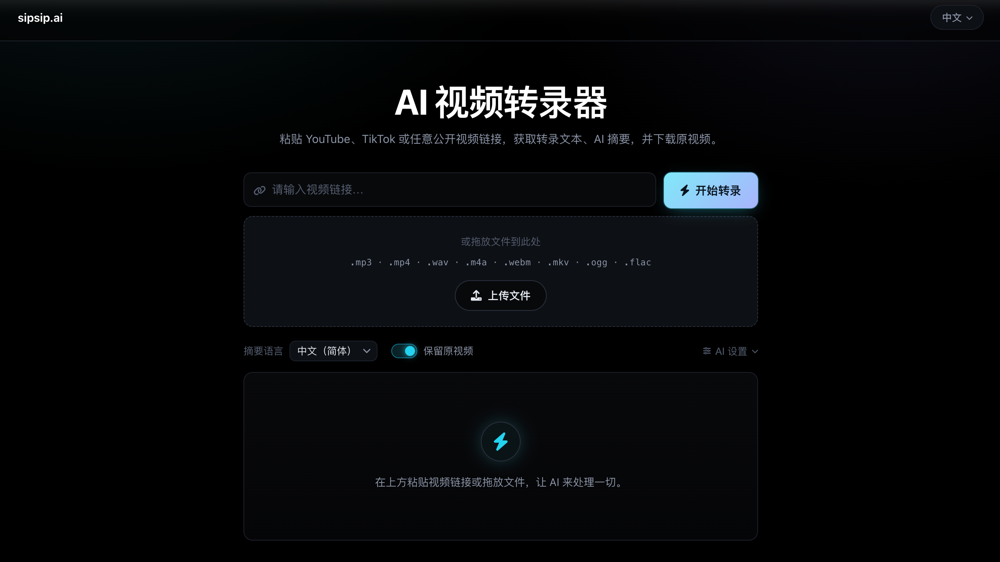

<div align="center">

# AI视频转录器

中文 | [English](README.md)

一款开源的 AI 视频/播客转录、摘要与归档工具：支持 YouTube、Bilibili、抖音、Apple Podcasts、SoundCloud 等 30+ 平台链接，**也支持本地上传**（音视频或纯文本）。



</div>

## ✨ 功能特性

- 🎥 **多平台支持**：支持 YouTube、Bilibili、抖音、Apple Podcasts、SoundCloud 等 30+ 平台
- ⚡ **字幕优先架构**：对有原生字幕的平台（如 YouTube）直接提取字幕文本，无需下载音频，速度大幅提升；无字幕时才回退到 Whisper 转录
- 🎬 **原视频下载**：转录的同时保留源视频。下载与转录**并行进行**，结果卡片内可直接预览播放，一键保存。走 Whisper 路径时音轨直接从这个视频里抽取，因此同一个视频只下载一次。只要文本时关掉「保留原视频」即可
- 📁 **本地上传**：支持拖放或选择文件 —— `.txt`（作为文稿直接进入后续管线）、`.mp3`、`.mp4`、`.m4a`、`.wav`、`.webm`、`.mkv`、`.ogg`、`.flac`。音视频经 FFmpeg 转码后由 Whisper 转录，优化、翻译、摘要流程与链接任务完全一致
- 🗣️ **智能转录**：无字幕时使用 Faster-Whisper 进行高精度语音转文字
- 🤖 **AI 文本优化**：自动错别字修正、句子完整化和智能分段
- 🌍 **多语言摘要**：支持 11 种语言的智能摘要生成
- ⚙️ **条件式翻译**：当所选摘要语言与转录语言不一致时，自动生成翻译
- 🔧 **自定义 AI 模型**：在页面中直接配置任意 OpenAI 兼容接口（OpenAI、OpenRouter、本地 LLM 等）—— 输入 API 地址和 Key，点击 **Fetch** 自动获取可用模型并选择
- 📡 **实时进度**：通过 SSE 推送实时状态，并用徽章标明本次走的是字幕模式还是 Whisper 模式
- 📱 **移动适配**：响应式布局，深色界面

## 📑 目录

- [快速开始](#quick-start)
- [使用指南](#usage-guide)
- [在 Claude / Codex / 脚本中调用](#agents)
- [接口说明](#api-reference)
- [技术架构](#architecture)
- [配置选项](#configuration)
- [常见问题](#faq)
- [支持的语言](#languages)
- [性能提示](#performance)
- [贡献指南](#contributing)

<a id="quick-start"></a>

## 🚀 快速开始

### 环境要求

- Python 3.8+
- FFmpeg（链接音频提取、原视频合流、本地上传转码均需）
- 任意 OpenAI 兼容服务商的 API Key（OpenAI、OpenRouter 等）—— 可直接在页面 UI 中配置，无需服务器环境变量

### 安装方法

<details open>
<summary><b>方法一：自动安装</b></summary>

```bash
git clone https://github.com/wendy7756/AI-Video-Transcriber.git
cd AI-Video-Transcriber

chmod +x install.sh
./install.sh
```

</details>

<details>
<summary><b>方法二：Docker 部署</b></summary>

```bash
git clone https://github.com/wendy7756/AI-Video-Transcriber.git
cd AI-Video-Transcriber

# 使用 Docker Compose（最简单）
cp .env.example .env
# 编辑 .env 设置服务端默认值（可选）
docker-compose up -d

# 或者直接使用 Docker
docker build -t ai-video-transcriber .
docker run -p 8000:8000 --env-file .env ai-video-transcriber
```

镜像基于 **Python 3.12**（Debian Bookworm），构建时会先升级 `pip` / `setuptools` / `wheel`，再按 `requirements.txt` 安装，与本地在新版 Python 下创建虚拟环境后安装的解析方式一致。

> **提示**：转录文件与下载的原视频保存在容器内 `/app/temp`。如需持久化到宿主机，请取消 `docker-compose.yml` 中 `volumes` 部分的注释。

</details>

<details>
<summary><b>方法三：手动安装</b></summary>

**1. 安装 Python 依赖**（建议使用虚拟环境）

```bash
# 创建并启用虚拟环境（macOS 推荐，避免 PEP 668 系统限制）
python3 -m venv venv
source venv/bin/activate
python -m pip install --upgrade pip
pip install -r requirements.txt
```

**2. 安装 FFmpeg**

```bash
brew install ffmpeg                              # macOS
sudo apt update && sudo apt install ffmpeg       # Ubuntu/Debian
sudo yum install ffmpeg                          # CentOS/RHEL
```

**3. 配置环境变量**（可选）

```bash
# 如需服务端默认值可设置，否则直接在页面 AI Settings 面板中配置
export OPENAI_API_KEY="your_api_key_here"
export OPENAI_BASE_URL="https://openrouter.ai/api/v1"   # 任意兼容端点
```

</details>

### 启动服务

```bash
python3 start.py
```

服务启动后，打开浏览器访问 `http://localhost:8000`。

**生产模式（推荐用于长视频）** —— 禁用热重载，让 SSE 连接在 30–60+ 分钟的长任务中保持稳定：

```bash
python3 start.py --prod
```

<details>
<summary>使用显式环境变量启动（示例）</summary>

```bash
source venv/bin/activate
export OPENAI_API_KEY=your_api_key_here                  # 可选：服务端默认值
# export OPENAI_BASE_URL=https://openrouter.ai/api/v1    # 可选：服务端默认值
python3 start.py --prod
```

</details>

<a id="usage-guide"></a>

## 📖 使用指南

**1. 选择输入方式：链接或本地文件**

- **视频/播客链接**：在输入框粘贴 YouTube、Bilibili 等支持的平台链接
- **本地上传**：将文件拖到虚线框内，或点击选择文件。点击同一个 **Transcribe** 按钮开始处理。上传与链接共用 `POST /api/process-video`（multipart 带 `file` 字段），便于反向代理只放行该路径时仍可使用上传

**2. 选择处理选项**

- **摘要语言** —— 摘要输出使用的语言
- **保留原视频** —— 默认开启。会下载源视频（≤720p），可在结果区预览和保存。只要文本时关掉它可以节省带宽和磁盘

**3.（可选）配置 AI 模型** —— 点击 **AI Settings** 展开面板

- 填写 **API Base URL**（如 `https://openrouter.ai/api/v1`）和 **API Key**
- 点击 **Fetch** 自动拉取该服务商的可用模型列表，然后选择；留空则使用服务器默认模型
- 凭据保存在浏览器 `localStorage` 中，只会发往你自己指定的服务商

**4. 开始处理** —— 点击 **Transcribe**。**链接任务**会显示当前模式徽章：

| 徽章 | 含义 |
|------|------|
| **⚡ Subtitle**（绿色） | 检测到原生字幕，秒级提取完成 |
| **🎙 Whisper**（青色） | 无字幕，下载音频后转录 |

**本地上传**时：音视频先经 FFmpeg 转码再由 Whisper 转录；纯 **`.txt`** 文件不下载、不跑 Whisper，直接进入文本优化与摘要流程。

**5. 查看结果**

- **转录文本** 和 **智能摘要** 标签页始终存在；当转录语言与所选摘要语言不一致时，会自动出现 **翻译** 标签页
- 每个标签页右侧都有独立的**紫色下载图标**，不切换标签也能直接下载对应文件
- **Download original video** 按钮位于标签栏右侧，下方是内嵌播放器，显示源文件及其大小

<a id="agents"></a>

## 🤖 在 Claude / Codex / 脚本中调用

除了 Web 界面，项目还提供了无头入口，agent 和脚本可以在不启服务、不开浏览器的情况下
跑同一套管线。

### 命令行

```bash
venv/bin/python transcribe.py "https://www.youtube.com/watch?v=VIDEO_ID" --json
venv/bin/python transcribe.py talk.mp4 -l zh --no-video
venv/bin/python transcribe.py notes.txt --no-llm          # 无需 API Key
```

`--json` 会把机器可读结果打到 stdout，进度信息走 stderr。
退出码：`0` 成功，`2` 输入不合法，`1` 下载/转码失败。

| 参数 | 含义 |
|------|------|
| `-l, --summary-language` | 摘要语言（`en`、`zh`、`es`、`fr`、`de`、`it`、`pt`、`ru`、`ja`、`ko`、`ar`） |
| `--no-llm` | 只输出转录文本，跳过优化/翻译/摘要，无需 API Key |
| `--no-video` | 不保留原视频 |
| `--whisper-model` | `tiny` … `large`，默认 `base` |
| `-o, --output-dir` | Markdown 输出目录，默认 `./temp` |
| `--json` / `-q` | 机器可读输出 / 静默进度 |

#### Agent 的 AI 服务商配置

CLI/agent 场景推荐用环境变量配置 OpenAI 兼容服务商：

```bash
export OPENAI_API_KEY="your_api_key_here"
export OPENAI_BASE_URL="https://openrouter.ai/api/v1"
export OPENAI_TRANSLATION_MODEL="gpt-4o"  # 可选
```

单次 CLI 调用也可以传 `--api-key`、`--base-url` 和 `--model`，但环境变量更安全，
因为 API key 不会直接留在 shell history 里。

### Codex App plugin

仓库也内置了一个 skills-only Codex 插件：

```text
.codex-plugin/plugin.json
skills/video-transcribe/SKILL.md
```

这个仓库根目录就是 plugin root。在 Codex App 中把这个目录作为本地插件导入或安装后，
新建任务并从 Plugins 中选择 **AI Video Transcriber** 即可。仓库带着插件文件不等于
已经自动安装；修改插件后需要刷新或重新安装插件，并新开任务让 Codex 重新加载 skill。
这个 skill 仍然包装上面的 CLI 管线，所以运行 Codex 的机器仍需准备好本仓库的 `venv`
和 `ffmpeg`。

Codex App 不会为这个 skills-only 插件自动生成项目专属的设置面板。想从 OpenRouter
切换到其他 OpenAI 兼容端点，需要更新 Codex 任务可见的环境变量，或让 Codex 在单次
运行 CLI 时传 `--base-url` / `--model`。

这个插件暂不把本地 stdio MCP 服务打包进去。如果希望 Codex 直接调用
`transcribe_video` MCP 工具，请按下面的方式单独注册 MCP server。

### Claude Code skill

仓库内置 `.claude/skills/video-transcribe/SKILL.md`，在本目录下使用 Claude Code 时会
自动识别 —— 直接让它转录某个链接即可。想全局可用，把该目录复制到 `~/.claude/skills/`。

### MCP 服务（Claude Code、Claude Desktop、Codex）

项目内置的是可选的 stdio MCP server。它不会自动注册到各个客户端，需要每个客户端
配置一次。

```bash
pip install "mcp>=2.0"

# 在仓库根目录执行：
claude mcp add video-transcriber \
  -e OPENAI_API_KEY=your_api_key_here \
  -e OPENAI_BASE_URL=https://openrouter.ai/api/v1 \
  -- "$(pwd)/venv/bin/python" "$(pwd)/mcp_server.py"

codex mcp add \
  --env OPENAI_API_KEY=your_api_key_here \
  --env OPENAI_BASE_URL=https://openrouter.ai/api/v1 \
  video-transcriber -- "$(pwd)/venv/bin/python" "$(pwd)/mcp_server.py"
```

如果更喜欢手动编辑 Codex 配置，也可以写入 `~/.codex/config.toml`：

```toml
[mcp_servers.video-transcriber]
command = "/abs/path/venv/bin/python"
args = ["/abs/path/mcp_server.py"]

[mcp_servers.video-transcriber.env]
OPENAI_API_KEY = "your_api_key_here"
OPENAI_BASE_URL = "https://openrouter.ai/api/v1"
```

Claude Desktop 则把同样的 command 和 args 加到 Claude Desktop 的 MCP 配置中：

```json
{
  "mcpServers": {
    "video-transcriber": {
      "command": "/abs/path/venv/bin/python",
      "args": ["/abs/path/mcp_server.py"],
      "env": {
        "OPENAI_API_KEY": "your_api_key_here",
        "OPENAI_BASE_URL": "https://openrouter.ai/api/v1"
      }
    }
  }
}
```

后续如果要换服务商，就更新 MCP 客户端保存的环境变量，或移除后用新的
`OPENAI_BASE_URL` / 模型设置重新添加 MCP server；如果客户端会常驻 MCP 进程，
还需要重启或刷新客户端。

对外暴露一个工具 `transcribe_video`，返回转录、摘要、可选翻译、文件路径以及
`no_speech` 标记。可用 `venv/bin/python mcp_server.py --selftest` 验证服务端是否正常，
再用 `claude mcp list` 或 `codex mcp list` 检查客户端是否已经注册。

> **注意 `no_speech`**：视频没有语音时，管线会完全跳过 LLM 并返回空文本。agent 应当
> 如实告知用户，而不是去猜内容 —— 把空文稿交给 LLM 会得到一段自信的虚构内容。

<a id="api-reference"></a>

## 🔌 接口说明

所有接口与前端页面同源。

| 方法 | 路径 | 用途 |
|------|------|------|
| `POST` | `/api/process-video` | 创建任务 —— 接受链接或 multipart `file` |
| `POST` | `/api/process-upload` | 仅上传的等价入口，行为一致 |
| `GET` | `/api/task-status/{task_id}` | 轮询任务状态 |
| `GET` | `/api/task-stream/{task_id}` | SSE 实时进度流 |
| `GET` | `/api/download/{filename}` | 以附件形式下载结果（`.md` 或媒体文件），可选 `?name=` 指定友好文件名 |
| `GET` | `/api/media/{filename}` | 内联播放媒体，支持 HTTP Range，可拖动进度条 |
| `DELETE` | `/api/task/{task_id}` | 取消运行中的任务并删除记录 |
| `POST` | `/api/models` | 代理：拉取任意 OpenAI 兼容服务商的模型列表 |
| `GET` | `/api/tasks/active` | 活跃任务计数（调试用） |

<details>
<summary><b><code>POST /api/process-video</code> 的表单字段</b></summary>

| 字段 | 类型 | 默认值 | 说明 |
|------|------|--------|------|
| `url` | string | `""` | 视频/播客链接，上传文件时可不传 |
| `file` | file | – | Multipart 上传，优先级高于 `url` |
| `summary_language` | string | `zh` | 摘要目标语言代码 |
| `download_video` | string | `1` | 传 `0`/`false`/`no`/`off` 可关闭原视频下载 |
| `api_key` | string | `""` | 单次请求使用的 API Key，未传则回落到 `OPENAI_API_KEY` |
| `model_base_url` | string | `""` | 单次请求使用的 OpenAI 兼容地址 |
| `model_id` | string | `""` | 使用的模型，留空则用服务端默认 |

```bash
# 转录链接，同时跳过原视频下载
curl -X POST http://localhost:8000/api/process-video \
  -F "url=https://www.youtube.com/watch?v=VIDEO_ID" \
  -F "summary_language=zh" \
  -F "download_video=0"
```

</details>

<a id="architecture"></a>

## 🛠️ 技术架构

**后端** —— FastAPI · yt-dlp（下载与字幕提取）· FFmpeg（音频提取、视频合流、上传文件转码为单声道 16 kHz）· Faster-Whisper（转录）· OpenAI 兼容接口（优化、翻译、摘要）

**前端** —— 原生 HTML5/CSS3/ES6+ · Marked.js（Markdown 渲染）· Font Awesome（图标）· SSE 实时进度

### 处理流程

```
链接 ──┬─→ 探测字幕 ──有字幕──→ 解析 VTT/SRT ──────────────┐
       │                                                  │
       │   （若开启「保留原视频」，与下面并行）                 ├─→ 文本优化
       └─→ 下载原视频（≤720p）──→ 抽取音轨 ──→ Whisper ──────┘   → 翻译*
                                                              → 生成摘要
文件 ─→ FFmpeg 转码 ──→ Whisper ─────────────────────────────┘   → 展示结果
      （.txt 直接进入文本管线）                                  (* 语言不一致时)
```

### 项目结构

```
AI-Video-Transcriber/
├── backend/
│   ├── main.py             # FastAPI 应用、路由、任务编排
│   ├── pipeline.py         # Web/CLI/MCP 共用的纯函数（含无语音判定）
│   ├── video_processor.py  # yt-dlp：字幕、音频、原视频
│   ├── transcriber.py      # Faster-Whisper 转录
│   ├── summarizer.py       # 文稿优化 + 摘要
│   ├── translator.py       # 条件式翻译
│   └── llm_sanitize.py     # LLM 输出后处理（去除套话等）
├── static/
│   ├── index.html          # 页面结构与样式
│   └── app.js              # 前端逻辑、SSE、多语言
├── temp/                   # 生成的转录、摘要与媒体文件
├── Dockerfile
├── docker-compose.yml
├── .env.example
├── requirements.txt
├── install.sh
├── start.py                # 启动脚本（--prod 禁用热重载）
├── transcribe.py           # 无头命令行入口（agent、脚本、定时任务）
├── mcp_server.py           # MCP 服务，暴露 transcribe_video 工具
├── .codex-plugin/
│   └── plugin.json         # Codex App 插件清单
├── skills/
│   └── video-transcribe/   # 包装 CLI 的 Codex plugin skill
└── .claude/skills/
    └── video-transcribe/   # 包装 CLI 的 Claude Code skill
```

<a id="configuration"></a>

## ⚙️ 配置选项

### 环境变量

全部为可选项 —— 不配置也能运行，AI 凭据可直接在页面中填写。

| 变量名 | 说明 | 默认值 |
|--------|------|--------|
| `OPENAI_API_KEY` | API 密钥（服务端默认值） | – |
| `OPENAI_BASE_URL` | OpenAI 兼容端点 | 服务商默认 |
| `OPENAI_TRANSLATION_MODEL` | 翻译使用的模型 | `gpt-4o` |
| `WHISPER_MODEL_SIZE` | Whisper 模型大小 | `base` |
| `UPLOAD_MAX_MB` | 本地上传单文件大小上限（MB） | `200` |
| `VIDEO_MAX_HEIGHT` | 原视频下载的清晰度上限 | `720` |
| `HOST` | 服务器地址 | `0.0.0.0` |
| `PORT` | 服务器端口 | `8000` |
| `PRODUCTION_MODE` | 设为 `true` 可禁用热重载（等同 `--prod`） | – |

### Whisper 模型大小选项

| 模型 | 参数量 | 速度 | 内存占用 |
|------|--------|------|----------|
| tiny | 39 M | 快 | 约 150 MB |
| base | 74 M | 中 | 约 250 MB |
| small | 244 M | 中 | 约 750 MB |
| medium | 769 M | 慢 | 约 1.5 GB |
| large | 1550 M | 很慢 | 约 3 GB |

所有尺寸均支持多语言，`tiny`–`medium` 另有英语专用版本。

<a id="faq"></a>

## 🔧 常见问题

<details>
<summary><b>保留原视频会让处理变慢吗？</b></summary>

通常影响不大。下载与转录、摘要并行执行，只在最后收尾时等待，因此大部分时间被本来就要做的工作掩盖掉了。走 Whisper 路径时它反而**省下一次下载** —— 音轨直接从这个视频文件里抽取，不必把媒体下载两遍。

默认限制在 720p，可以调低 `VIDEO_MAX_HEIGHT` 节省带宽，或只要文本时直接关掉开关。即使原视频下载失败，转录也会正常完成，只是结果区不显示播放器。

</details>

<details>
<summary><b><code>temp/</code> 目录会一直变大吗？</b></summary>

会。转录、摘要和下载的原视频在任务结束后会特意保留，方便随时下载，目前没有自动清理。现在还会存原视频，建议定期清理：

```bash
# 删除 7 天前生成的文件
find temp -type f -mtime +7 ! -name 'tasks.json' -delete
```

</details>

<details>
<summary><b>为什么转录速度很慢？</b></summary>

转录速度取决于视频长度、Whisper 模型大小和硬件性能。可以换用更小的模型（`tiny` 或 `base`）提速。另外，有原生字幕的视频会完全跳过 Whisper，几秒即可完成。

</details>

<details>
<summary><b>支持哪些视频平台？</b></summary>

支持所有 yt-dlp 支持的平台，包括但不限于 YouTube、抖音、Facebook、Instagram、X/Twitter、Bilibili、优酷、爱奇艺、腾讯视频、Apple Podcasts、SoundCloud 等。

</details>

<details>
<summary><b>本地上传支持哪些格式？大小有限制吗？</b></summary>

允许的扩展名：`.txt`、`.mp3`、`.mp4`、`.m4a`、`.wav`、`.webm`、`.mkv`、`.ogg`、`.flac`。默认单文件上限 **200 MB**，可通过 `UPLOAD_MAX_MB` 调整。

</details>

<details>
<summary><b>AI 优化功能不可用怎么办？</b></summary>

AI 功能需要任意 OpenAI 兼容服务商的 API Key。可直接在页面 **AI Settings** 面板中填写（无需重启），也可通过 `OPENAI_API_KEY` 设置服务端默认值。没有 Key 时转录仍然可用（Whisper 在本地运行），但优化、翻译和摘要会退化为基础排版。

</details>

<details>
<summary><b>出现 500 报错/白屏，是代码问题吗？</b></summary>

多数情况下是环境配置问题，请按以下清单排查：

- 是否已激活虚拟环境：`source venv/bin/activate`
- 依赖是否装在虚拟环境中：`pip install -r requirements.txt`
- 是否在 **AI Settings** 面板配置了 API Key，或设置了 `OPENAI_API_KEY`
- 是否已安装 FFmpeg：macOS `brew install ffmpeg` / Debian/Ubuntu `sudo apt install ffmpeg`
- 8000 端口是否被占用，或改用其他 `PORT`

</details>

<details>
<summary><b>如何使用 Docker 部署？</b></summary>

**前置条件**：从 https://www.docker.com/products/docker-desktop/ 安装 Docker Desktop，并确保服务正在运行。

```bash
git clone https://github.com/wendy7756/AI-Video-Transcriber.git
cd AI-Video-Transcriber
cp .env.example .env      # 编辑以设置服务端默认值（可选）

docker-compose up -d      # 推荐

# 或手动构建运行
docker build -t ai-video-transcriber .
docker run -p 8000:8000 --env-file .env ai-video-transcriber
```

**常见问题**

- **端口冲突** —— 改用 `-p 8001:8000`
- **权限拒绝** —— 确认 Docker Desktop 正在运行
- **构建失败** —— 检查磁盘空间（需约 2 GB 空闲）和网络连接
- **容器无法启动** —— 通过 `docker logs <容器ID>` 查看日志

**常用命令**

```bash
docker ps                                                    # 查看运行中的容器
docker logs ai-video-transcriber-ai-video-transcriber-1      # 查看日志
docker-compose down                                          # 停止服务
docker-compose build --no-cache                              # 修改后重新构建
```

</details>

<details>
<summary><b>内存需求是多少？</b></summary>

**Docker 部署**：空闲约 128 MB，处理中 500 MB–2 GB，镜像约 1.6 GB。推荐 4 GB+ 内存。

**传统部署**：FastAPI 服务约 50–100 MB，加上 Whisper 模型（见上表），再加处理过程峰值约 500 MB。

```bash
# 减少内存占用
WHISPER_MODEL_SIZE=tiny

# 限制容器内存
docker run -m 1g -p 8000:8000 --env-file .env ai-video-transcriber

# 监控
docker stats ai-video-transcriber-ai-video-transcriber-1
```

</details>

<details>
<summary><b>网络连接错误或超时怎么办？</b></summary>

典型表现：下载时提示「无法提取」或超时、API 连接超时/DNS 解析失败、Docker 拉取极慢。

1. **切换 VPN/代理** 到其他服务器
2. **检查网络稳定性**
3. 更改网络设置后**等待 30–60 秒**再重试
4. **验证自定义端点**在当前网络下可访问
5. 容器网络失败时**重启 Docker Desktop**

```bash
curl -I https://www.youtube.com/     # 平台访问
curl -I https://openrouter.ai        # AI 服务商
docker pull hello-world              # Docker Hub
```

</details>

<a id="languages"></a>

## 🎯 支持的语言

**转录** —— 通过 Whisper 支持 100+ 种语言，自动检测语言。

**摘要与翻译** —— 英语、中文（简体）、日语、韩语、西班牙语、法语、德语、意大利语、葡萄牙语、俄语、阿拉伯语。

**界面** —— 中文与英文，可在右上角切换。

<a id="performance"></a>

## 📈 性能提示

**硬件要求**

- 最低配置：4 GB 内存，双核 CPU
- 推荐配置：8 GB 内存，四核 CPU
- 理想配置：16 GB 内存，多核 CPU，SSD 存储

**处理时间预估**

| 视频长度 | 字幕模式 | Whisper 模式 | 备注 |
|---------|---------|-------------|------|
| 1 分钟 | ≈5 秒 | 30 秒–1 分钟 | 字幕模式无需下载音频 |
| 5 分钟 | ≈10 秒 | 2–5 分钟 | YouTube 自动字幕会触发字幕模式 |
| 15 分钟 | ≈15 秒 | 5–15 分钟 | 大多数 YouTube 视频支持字幕模式 |
| 30 分钟+ | ≈20 秒 | 15–60 分钟 | 纯音频/播客始终使用 Whisper |

以上数据基于**关闭**「保留原视频」。开启后，字幕模式任务的耗时主要取决于视频下载而非转录；由于下载与 AI 步骤重叠，实际增加的总时长通常明显小于下载本身所需的时间。

<a id="contributing"></a>

## 🤝 贡献指南

欢迎提交 Issue 和 Pull Request！

1. Fork 项目
2. 创建功能分支（`git checkout -b feature/AmazingFeature`）
3. 提交更改（`git commit -m 'Add some AmazingFeature'`）
4. 推送到分支（`git push origin feature/AmazingFeature`）
5. 开启 Pull Request

## 致谢

- [yt-dlp](https://github.com/yt-dlp/yt-dlp) —— 强大的视频下载工具
- [Faster-Whisper](https://github.com/guillaumekln/faster-whisper) —— 高效的 Whisper 实现
- [FastAPI](https://fastapi.tiangolo.com/) —— 现代化的 Python Web 框架
- [OpenAI](https://openai.com/) —— 智能文本处理 API

## 📞 联系方式

如有问题或建议，请提交 Issue 或联系 Wendy。

---

## 🚀 体验完整功能 — sipsip.ai

本工具是 **[sipsip.ai](https://sipsip.ai)** 的开源部分。

完整产品提供更多功能：

- 📧 **每日邮件简报** —— 关注你喜欢的创作者，每天早上收到 AI 整理的内容摘要
- ⚡ 随时转录和总结任意视频和播客
- 🌐 全功能支持多语言

**免费开始使用** —— 无需绑定信用卡。

➡️ [sipsip.ai](https://sipsip.ai)

---

## 同一开发者的其他项目

- 要录视频的话，可以用这个 [最好用的免费提词器](https://teleprompter.works)：直接在浏览器使用或者下载[app版本](https://apps.apple.com/app/teleprompter-scrolling-scripts/id6767148844)获得更好的使用体验。
- 想在 Pinterest 上获得增长的话，可以用 [GetPinFast](https://getpin.fast)，帮产品拿到更多流量和转化。

---

⭐ 如果你觉得这个项目有帮助，请考虑给它一个 Star！
